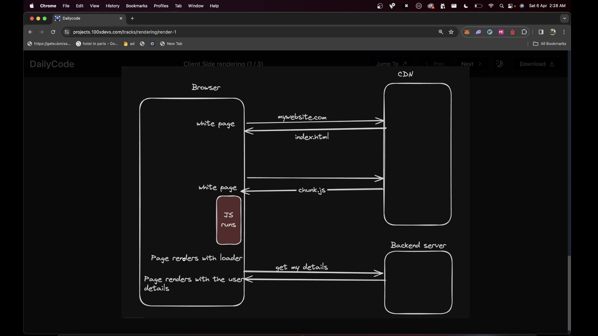
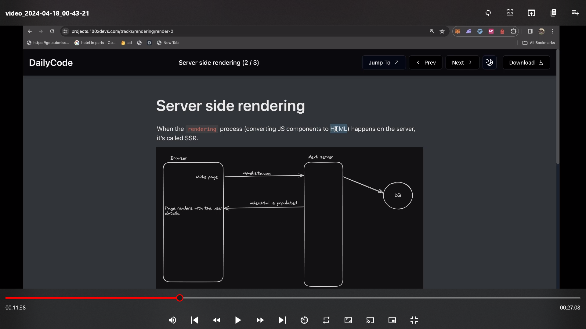
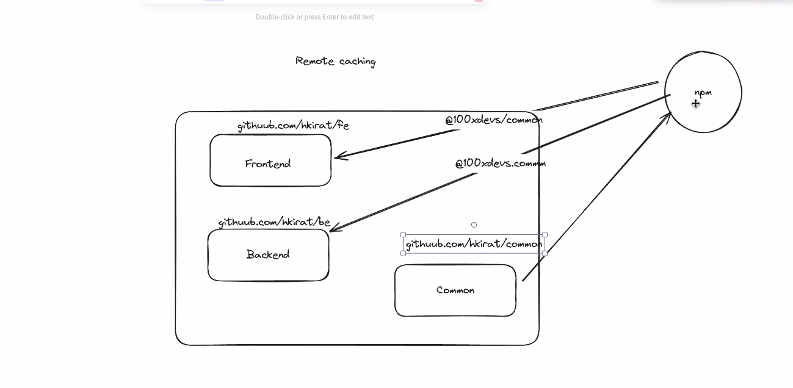
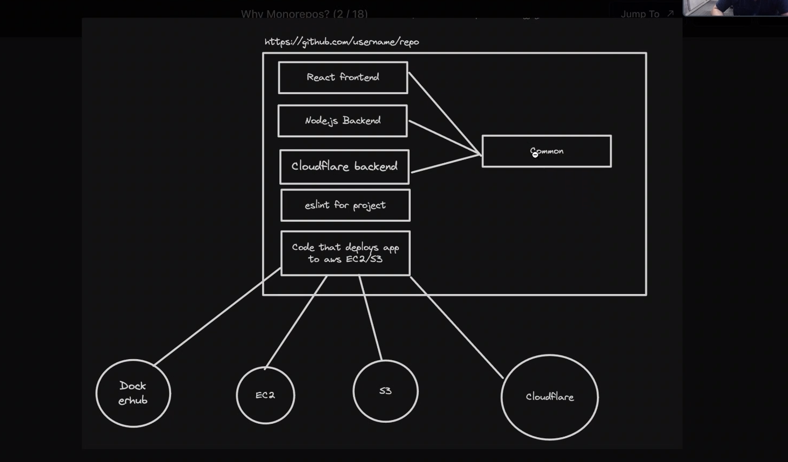
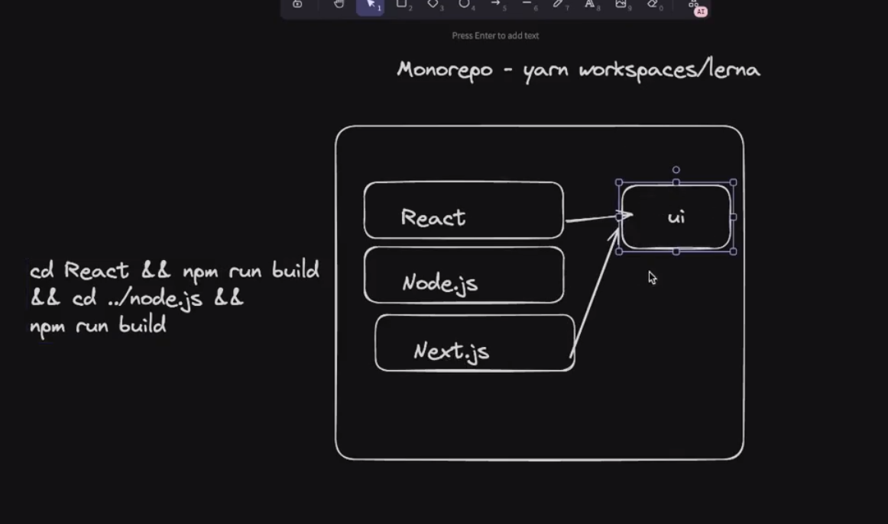
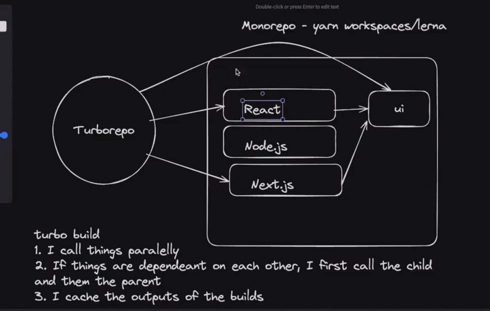
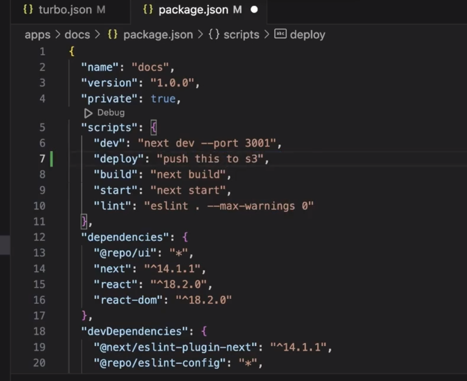

# SQL vs NoSQL

## SQL
SQL databases are traditionally used in applications where data integrity, consistency, and complex queries are crucial. This includes financial applications, ERP systems, and applications with well-defined schemas.

## NoSQL
NoSQL databases are preferred in scenarios where high scalability, flexibility, and performance are required. This includes web applications dealing with large volumes of data, real-time analytics, IoT applications, and applications with evolving or dynamic schemas.

---

# SQL Injection

- **Definition:** SQL injection is a security vulnerability.
- **Attack Vector:** Attackers insert malicious SQL statements into input fields or queries.
- **Objective:** Manipulate the backend database to gain unauthorized access, leak data, or manipulate data.
- **Causes:** Often arises from improper input validation or handling of user input in SQL queries.
- **Consequences:** Can lead to unauthorized data access, data leakage, data manipulation, or complete system compromise.
- **Preventive Measures:** Use parameterized queries, input validation, and escape special characters to mitigate the risk.

---

# ORMs

- **Simpler Syntax:** ORMs offer an easier way to interact with databases by providing a simplified syntax, reducing the need for complex SQL queries.
- **Abstraction over DB Queries:** ORMs abstract database queries into high-level programming constructs, making it easier to work with database operations using object-oriented paradigms.
- **Portability:** This portability allows developers to switch between different database systems with minimal code changes, providing flexibility and reducing vendor lock-in.
- **Security:** ORMs often include security features such as parameterized queries and input sanitization to prevent common vulnerabilities like SQL injection attacks.
- **Automatic Migrations:** Automatically synchronize changes in the codebase with the database schema, ensuring consistency and reducing manual intervention.

---

# Serverless Architecture

Enables efficient and cost-effective application development and deployment.
- Cloud computing model
- Developers focus on code (functions)
- No server management
- Cloud provider handles infrastructure

When to use:
- No worry about Deployments
- No worry about auto-scaling
- Very Low traffic & optimization for costs

Benefits:
- Reduced complexity
- Auto-scaling
- Cost effective for low-scale. (Since Pay per request-basis)
- Faster time to market
- High availability

Drawbacks:
- More Expensive at bigger scale
- Cold start problem
- Limited control over infrastructure

---

# Cloudflare

- Cloudflare Workers have their own runtime environment.
- This environment is optimized for Cloudflare's global network, not Node.js.
- Workers support JavaScript and TypeScript but have their own APIs and limitations.

Why? 
- Cost-effective: Pay-as-you-go pricing model.
- Event-driven: Execution based on events like HTTP requests.
- Edge computing: Runs closer to end-users for faster responses.
- Isolation and security: Code executes in isolated environments.
- Scalability: Automatically scales to handle varying workloads.
- Cost-effective pricing: Pay only for resources consumed.

Hono : A library to mimic Express like functionalities in Cloudflare Worker Environment....

---

# AWS

- Rent Servers
- Manage Domains
- Upload Media
- Auto scaling
- Create Kubernetes Cluster

## Deploying BackEnd - AWS EC2 Instance SetUp

1. Buy an EC2 instance in AWS Data Center Mumbai:
   - Log in to the AWS Management Console.
   - Navigate to the EC2 dashboard.
   - Click on "Launch Instance" and follow the wizard to choose the desired specifications for your EC2 instance.

2. SSH into the EC2 instance in Git Bash:
   - Use the SSH command to connect to your EC2 instance:
     chmod 400 your-key.pem 
     ssh -i your-key.pem ec2-user@your-instance-public-ip

3. Allow internet connectivity:
   - Edit the /etc/resolv.conf file to add DNS nameservers:
     sudo vi /etc/resolv.conf
     (Press i to enter insert mode, then add the line: nameserver 8.8.8.8)
     (Press Esc, then type :wq and press Enter to save and exit)

4. Clone the backend repository:
   - Use Git to clone the repository:
     git clone repository-url

5. Install Node.js through nvm:
   - Install nvm (Node Version Manager):
     curl -o- https://raw.githubusercontent.com/nvm-sh/nvm/v0.39.0/install.sh | bash
     source ~/.bashrc
   - Install Node.js using nvm:
     nvm install node

6. Install dependencies:
   - Navigate to the backend directory:
     cd backend-directory
   - Install dependencies using npm:
     npm install

7. Configure reverse proxy (if required):
   - Install and configure a reverse proxy server such as Nginx:
     sudo yum install nginx    # For Amazon Linux
     sudo apt-get install nginx    # For Ubuntu
   - Create a new configuration file for your application:
     sudo vi /etc/nginx/sites-available/your-app
   - Add configuration settings for reverse proxying:
     server {
         listen 80;
         server_name your-domain.com;

         location / {
             proxy_pass http://localhost:your-app-port;
             proxy_set_header Host $host;
             proxy_set_header X-Real-IP $remote_addr;
             proxy_set_header X-Forwarded-For $proxy_add_x_forwarded_for;
             proxy_set_header X-Forwarded-Proto $scheme;
         }
     }
   - Enable the configuration file by creating a symbolic link:
     sudo ln -s /etc/nginx/sites-available/your-app /etc/nginx/sites-enabled/
   - Test the Nginx configuration and restart the Nginx service:
     sudo nginx -t
     sudo service nginx restart

8. Run the Node.js application using pm2:
   - Install pm2 globally if you haven't already:
     npm install -g pm2
   - Start your Node.js application with pm2:
     pm2 start index.js

9. Ensure the Node.js application is running:
   - Check the status of the pm2 process:
     pm2 list
   - Verify that your Node.js application is listed and running.

## Deploying FrontEnd - S3 Bucket and (CDN) CloudFront SetUp

1. Create React Frontend:
   - Develop your frontend application using React or any other frontend framework.

2. Build the Project:
   - Build your project to generate production-ready optimized files.

3. Create a New S3 Bucket and Upload All the Frontend Files:
   - Create a new S3 bucket in the AWS Management Console.
   - Upload all the frontend files and bundles to the S3 bucket.

4. Configure Amazon CloudFront as CDN:
   - Create a CloudFront distribution in the AWS Management Console.
   - Configure the distribution to use the S3 bucket as the origin.
   - Set up proper origin access control settings to restrict access to CloudFront only.

5. Enable Security Protection:
   - Enable security features such as HTTPS (SSL/TLS) encryption for the CloudFront distribution.

6. Set Up Default Root Object:
   - Specify the default root object (e.g., index.html) for the CloudFront distribution.

7. Create the Distribution:
   - Create the CloudFront distribution with the specified settings.

8. Edit the Bucket Policy:
   - Edit the S3 bucket policy to allow access from the CloudFront distribution.
   - Copy and paste the bucket policy (JSON) from the CloudFront distribution settings to the S3 bucket policy.

9. Wait for Deployment:
   - Wait for the CloudFront distribution to be deployed and become fully operational.

10. Edit the Cloudflare Distribution Domain Name:
    - Request an SSL certificate (HTTPS) for your custom domain using AWS Certificate Manager.
    - Choose the certificate after verification through Google Domains.

11. Make the Custom Domain Name Point to the Cloudflare Domain in Google Domains:
    - Update the DNS settings in Google Domains to point your custom domain to the CloudFront distribution domain name.

12. Save the Settings:
    - Save the DNS settings in Google Domains.

13. Set Up Error Responses:
    - Specify the error response settings, such as routing all errors to a custom error page (e.g., index.html) with a status code of 200.

14. Create Invalidation:
    - Create an invalidation to clear the CloudFront cache if required.

15. Test Your Custom Domain URL:
    - Test your custom domain URL to ensure that the frontend application is accessible and functioning correctly.

---

# Next.js vs. React

## React Problems

1. **Separation of Frontend and Backend:** React traditionally requires developers to set up separate frontend and backend projects, leading to additional complexity in managing codebases.

2. **Routing:** React does not come with built-in routing capabilities, requiring developers to integrate third-party libraries or implement custom routing solutions.

3. **SEO Optimization:** Initial HTML fetched on request often lacks meaningful content, impacting search engine optimization (SEO) efforts.

4. **Waterfalling Problem:** React applications may suffer from the waterfalling problem, where a request cannot be initiated until the repsonse of previous request has been served which leads to inefficient loading times.

## Next.js Offerings

1. **SEO Optimization:** Next.js provides Server-Side Rendering (SSR) out of the box, enabling search engines to crawl and index content more effectively.

2. **Full Stack Capability:** With API routes, Next.js allows developers to build full-stack applications seamlessly, handling both frontend and backend logic within the same codebase.

3. **File-Based Routing:** Next.js simplifies routing by adopting a file-based routing system, making it intuitive to navigate between pages and components.

4. **Bundle Optimization:** Next.js offers optimizations for bundling, resulting in faster loading times and improved performance for web applications.

## Next.js Downsides

1. **Server Dependency:** Next.js applications cannot be distributed via a Content Delivery Network (CDN) alone, as they require a server for SSR. This server dependency can be costly to maintain at large scales.

2. **Opinionated:** Next.js follows a specific set of conventions and opinions, which may limit flexibility for developers who prefer more customization options.

# Client-side Data Fetching vs. Server-side Data Fetching vs Static Site Generation

## Client-side Data Fetching

 

- Fetches data after page rendering.
- Useful for dynamic content.
- No SEO indexing required.
- Data not pre-rendered.
- Initial page-load performance may be affected.
- Not suitable for sensitive data transfer.

## Server-side Data Fetching

- Fetches data before page rendering.
- Best for SEO indexing.
- Allows pre-rendering of data.
- Improved initial page-load performance.
- Can coexist with client-side fetching.
- Suitable for pages requiring search engine indexing.

## Static Site Generation (SSG)

- Pre-renders pages at build time.
- Offers improved performance and SEO.
- Ideal for content-heavy websites.
- Does not require server-side rendering on each request.
- Enhances user experience with faster page loads.
- Useful mainly when the page content is same for almost every user.

# Server Actions in Next.js

## Purpose and Functionality

Server actions simplify mutation handling by serving as a mechanism for performing POST requests without the need for explicit API routes. They abstract away the complexity of setting up API routes and route handlers, reducing boilerplate code.

## Advantages

- **Ease of Use:** Eliminates the need for creating API routes and reduces the amount of boilerplate code required.
- **CSRF Protection:** Offers CSRF protection by default, enhancing security.
- **Type Safety and Validation:** Provides type safety and validation between the client and server, enhancing code reliability and safety.
- **Authentication Integration:** Can integrate with authentication providers like next-auth or clerk, streamlining authentication processes.
- **Compatibility with React Server Components (RSCs):** Works seamlessly with RSCs, enabling interactions even without JavaScript enabled, thus improving accessibility and user experience.

## Use Cases

- **Mutations:** Primarily used for mutations, such as updating a database directly server-side, without the need to manually call APIs for data updates.
<!-- - **Counting Views on Posts:** Example of a creative use case where server actions are used to count views on posts, demonstrating flexibility in application. -->

## Caveats

- **Not for Data Fetching:** While server actions excel at handling mutations, they are not recommended for data fetching tasks. Instead, other methods like RSCs or client-side data fetching (e.g., react-query, SWR) are preferred for fetching data from the server.

## Opinions and Recommendations

- **Preference for API Routes:** Some users prefer sticking to traditional API routes for better control and clarity in handling data fetching and mutations separately.
- **Usefulness with a Separate Backend:** There's a consensus that server actions might not be as useful when a separate backend already exists. In such cases, direct communication between the client and the backend might be more efficient.
- **BFF Approach:** While server actions can be part of a Backend For Frontend (BFF) architecture, their utility in this setup might be limited compared to handling mutations directly on the separate backend.
- **Security Concerns:** There's a need for further investigation into the security implications of using server actions extensively, especially in production environments.

Overall, while server actions offer several advantages in simplifying mutation handling and improving developer experience, their use should be evaluated based on specific project requirements, security considerations, and compatibility with existing backend architectures.

<!-- 
import { PrismaClient } from '@prisma/client'

const prismaClientSingleton = () => {
  return new PrismaClient()
}

declare const globalThis: {
  prismaGlobal: ReturnType<typeof prismaClientSingleton>;
} & typeof global;

const prisma = globalThis.prismaGlobal || prismaClientSingleton()

export default prisma

if (process.env.NODE_ENV !== 'production') globalThis.prismaGlobal = prisma -->
---

# MonoRepos

Monorepos facilitate sharing common reusable code between multiple modules, enhancing collaboration between developers.

## Traditional Approach in Pre-MonoRepo Days

## MonoRepo Approach

---

## Turbo Repo - A Build Orchestrator

Build Orchestrator means with just a single global build command, running all the build commands of each module in the turborepo.

**Advantages:**
- **Caches Build:** Ensures that unchanged modules do not get re-built on subsequent global rebuilds.
- **Parallelization:** Can run multiple builds concurrently, enhancing resource utilization.
- **Dependency Awareness:** Well-aware of all dependencies in the whole repo, knowing which modules depend on others.
- **Remote Caching:** Prevents the redeployment of unchanged modules due to changes in other modules.

**Traditional Build with Normal Monorepo (Sequential Builds)**

**Turbo Build (Parallel Builds, also ensures if a parent module is dependent on some child, the child gets built first and then the parent)**

**turbo.json (Defines Pipelines like what to run when)**

